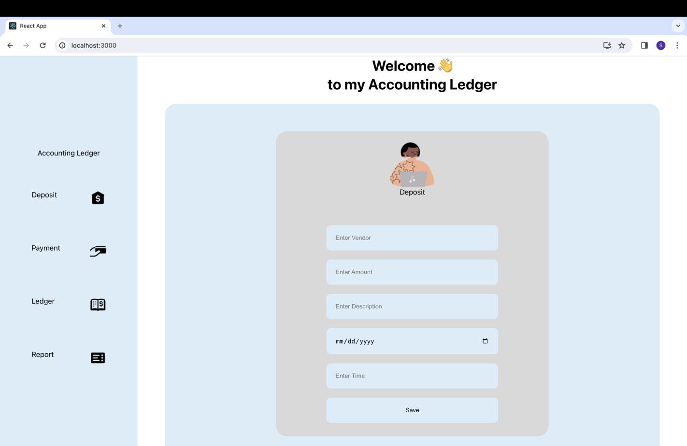
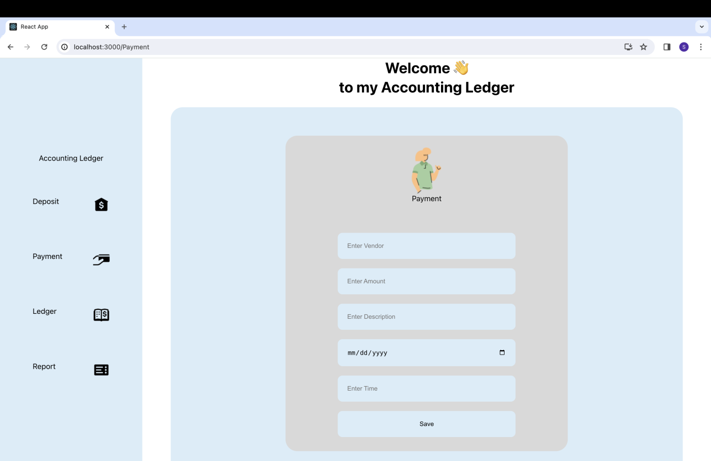
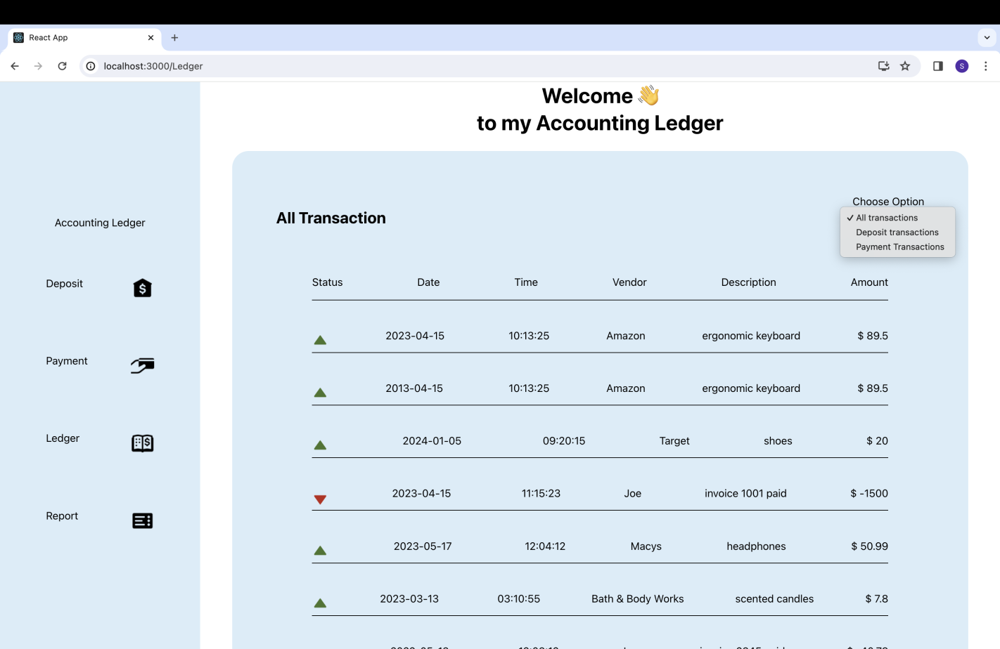
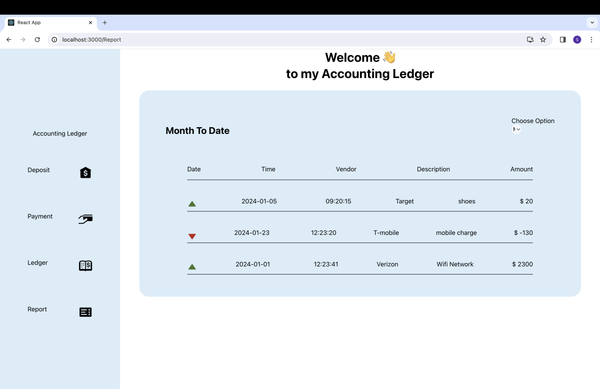

# AccountingLedger-Capstone1

## Project Overview

Accounting Ledger is a fully functional ledger website with a Spring Boot API backend and MySQL database for data storage, and ReactJS/HTML/CSS for the frontend. 

Accounting Ledger allows users to efficiently manage and keep track of their financial transactions. It allows users to record deposits and payments, view a ledger of all the user's financial activities, and run various financial reports.
The project involves fixing existing bugs in the project and implementing new features, all while ensuring the frontend and backend functions smoothly.

## Built With
  - **Backend:** Java, MySQL, CSV files
  - **Frontend:** ReactJS, HTML, CSS

## Application Features

### Home Screen

Upon launching the application, users are presented with the following options:

- **D) Add Deposit:** Add a new deposit entry to the transaction log.
- **P) Make Payment(Debit):** Record a new payment transaction.
- **L) Ledger:** View transaction entries, categorized and sorted.
- **X) Exit:** Close the application.

### Ledger Screen

The Ledger Screen provides options to view transaction entries based on different filters:

- **A) All:** Display all transactions, with the newest entries first.
- **D) Deposits:** View deposit transactions.
- **P) Payments:** View payment transactions.
- **R) Reports:** Generate predefined or custom reports.
   - **1) Month To Date:** Display transactions for the current month.
   - **2) Previous Month:** Show transactions for the previous month.
   - **3) Year To Date:** View transactions for the current year.
   - **4) Previous Year:** Display transactions for the previous year.
   - **5) Search by Vendor:** Enter a vendor name to view related transactions.
   - **0) Back:** Return to the Reports menu.
   - **H) Home:** Go back to the Home Screen.

## Getting Started

1. Clone or download this repository to your local machine.

2. Compile the Java code using your preferred Java development environment.

3. Run the application in the command line.

## Instructions
**Follow On-Screen Instructions:**
- Select options from the Home Screen.
- Enter details for deposits and payments as prompted.
- Explore ledger entries and generate reports.
- Exit the Application from the Home Screen.

## Usage
- When you run the application, you'll be presented with a user-friendly menu where you can choose to add deposits, make payments, view your ledger, generate reports, or exit the application.

- The ledger entries are automatically sorted by date in descending order, showing the newest transactions first, making it easy to stay up-to-date with your financial activities.

## Frontend Pictures

### Deposit
    

### Payment

### All Transactions

### Month To Date Transactions

    

## UML Diagram

## Submitted By Dragon Squad
Dragon Squad members: **Kary Martinez, Elizabeth Dookie, Dipesh Basnet, Shankar Ale Magar, Hally Amor, Tyson Hall**

